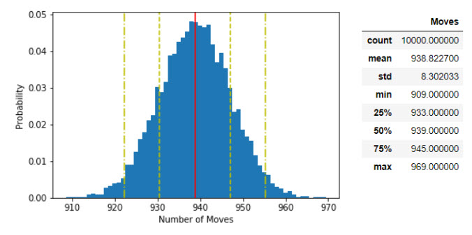

# markovchain_2048game

Modeling 2048 into a Discrete-Time Time Homogenous Markov Chain using Python

## Getting Started

The process is broken down into 2 notebooks, Generate states.ipynb notebook creates all possible states in a 2048 game. 2048.ipynb notebook loads the states generated for analysis. Do note that the assumption made is that the game does not use a board structure, all the tiles go into a bag and similar tiles must merge at the next step.

## Running the tests

1. Run all the code in Generate states.ipynb and it should generate a 'generated_states.csv' file.
2. Run all the code in 2048.ipynb and it should generate average number of steps to win the game using Linear Algebra and Monte Carlo.

## Results

* **Transition Matrix** 

* **Average Steps to Win 2048** 

  * Monte Carlo Simulation

  

  * Linear Algebra 

  
  
* **Probability of Winning States**

## Acknowledgments

* Inspired by [John Lees-Miller's](https://jdlm.info/articles/2017/08/05/markov-chain-2048.html) article about 2048 as a Markov Chain
